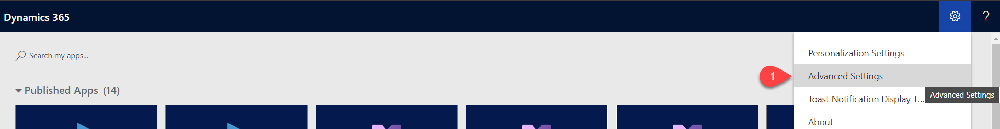
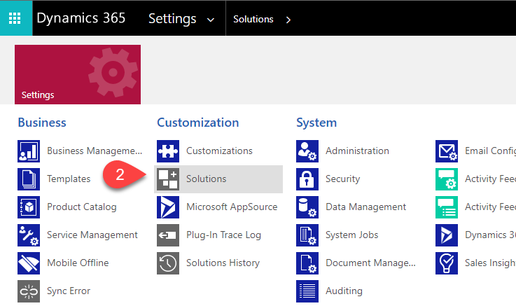

# Welcome - PowerDynCustomLabelPCF control

## Details

* Company: [PowerDyn Solutions](https://www.powerdyn.net/)
* Author: [David Merdian](mailto:david.merdian@powerdyn.net)
* Description: This is a custom control that allows you to update the label for Text field types. With the ability to support SingleLine fields and Multiple fields, you are able to write as long of a label as you need for a field!

## Install Pre-built Solutions

As part of this project, there are two pre-built solutions - Un-managed and Managed. We recommend using the Un-managed solution if you wish to be able to debug the code. This is mainly designed for your development/sandbox environment. Once everything is configured and working as expected, we strongly recommend using the Managed solution for your production environment as all the code is optimized for performance. Please note - with the Managed solution you will not be able to debug the control.

* Un-managed Solution: C:\Controls\PowerDynCustomLabelPCF\Solutions\Un-managed\
* Managed Solution:    C:\Controls\PowerDynCustomLabelPCF\Solutions\Managed\

## Setup Project to Compile Yourself

1. Create new folder - C:\Controls\PowerDynCustomLabelPCF
2. Download project and extract to folder from Step 1.
3. Open Developer Command Prompt. Switch to folder in Step 1.
4. run - npm install
5. Install typescript - npm install --save-dev typescript

## Steps to build project

1. Open Developer Command Prompt

2. Navigate to where index.ts is
CMD:npm run build
optional -npm start

3. Navigate to folder where you want to create zip (i.e. PowerDynCustomLabel or Deployment)
   pac solution init --publisher-name PowerDynSolutions --publisher-prefix powerdyn

4. Add reference - pac solution add-reference --path (path or relative path of your PowerApps component framework project on disk)
   pac solution add-reference --path C:\Controls\PowerDynCustomLabelPCF

5. Build
MSBUILD /t:restore
MSBUILD /p:configuration=Release (if you wanted it managed and compressed. If you want to be able to debug it, just use MSBUILD)
MSBUILD

6. Install: To install inside of Dynamics follow these steps.
   1. Navigate to Advance Settings, then click on Advance Settings 
   2. Click Settings > Solutions > Import   
   3. If you wish to install the pre-built version - navigate to C:\Controls\PowerDynCustomLabelPCF\SolutionPackage otherwise if you used the Developer Command Prompt to build the project then navigate to C:\Controls\PowerDynCustomLabelPCF\PowerDynCustomLabelPCF\PowerDynCustomLabel and select zip.
